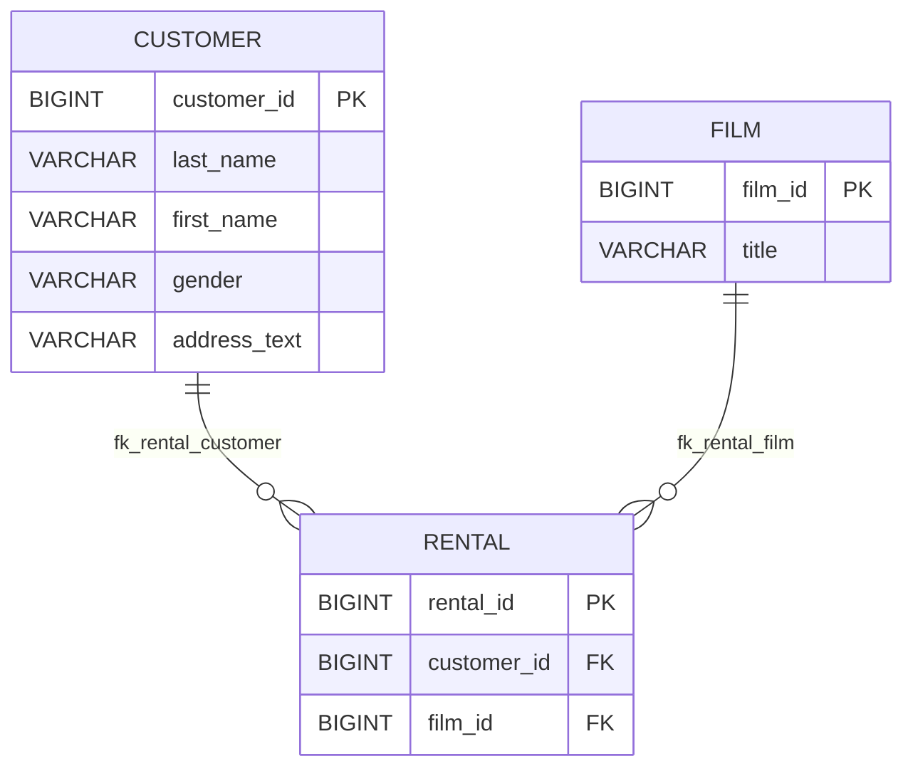

# Database Diagram for `3.sql`

```mermaid
erDiagram
    CUSTOMER {
        BIGINT customer_id PK
        VARCHAR last_name
        VARCHAR first_name
        VARCHAR gender
        VARCHAR address_text
    }

    FILM {
        BIGINT film_id PK
        VARCHAR title
    }

    RENTAL {
        BIGINT rental_id PK
        BIGINT customer_id FK
        BIGINT film_id FK
    }

    CUSTOMER ||--o{ RENTAL : "fk_rental_customer"
    FILM ||--o{ RENTAL : "fk_rental_film"
```
